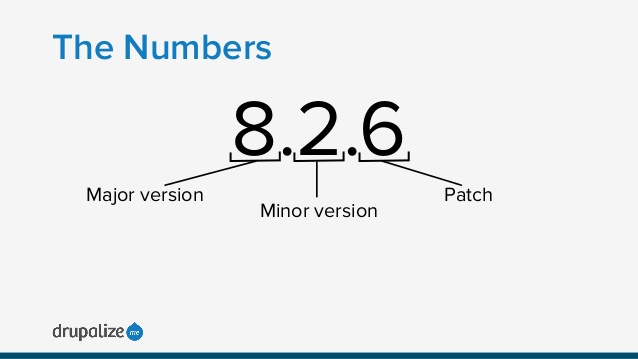
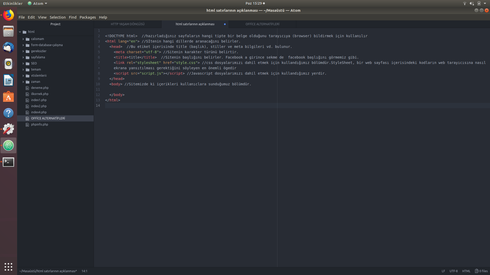

# GENEL TEKRAR

## GİTHUB KOMUTLARI:
```
git status //DEğişiklik yapılan dosyaları gösteriyor(Kırmızı renkte consol renkleri değişebilir bilgim yok.)
git add . //Klasörlerin hepsini github a eklemek için hazır ediyor.
git commit -m "Açıklama"  //dosyada değişiklik yaptığımızı ve ne değişikliği yaptığımızı eklememizi sağlıyor.
git push -u origin master //Github da dosyalarımızdaki değişiklikleri tamamlıyor.
```
Temel Linux KOmutları:
```
pwd : Hangi dizinde  olduğumuzu gösteriyor.
ls : Olduğumuz dizinde ki Klasörleri ve dosyaları listeliyor.
sudo su : SÜper yetkili oluyoruz.
sudo apt get install : install dan sonra yüklemek istediğimizpaket ismini yazıyoruz.Örneğin sudo apt get install spotify gibi.
```

html symbols ve html entities google'da aratarak html etiket ve sembollerini kullanmamızı sağlayan html etiketlerine erişebilir.


## VERSİYON


Majör minör bug-fix olarak ayrılır.BUG(Hata) lar düzeltildiği zaman en sondaki sayımız
artar.Programa yenilik getirdiğimiz zaman ortaki sayımız.Programda radikal bir değiliklik
yapılılarsa en baştaki sayımız artar.


## NEDEN GITHUB’DA PROJELERE DESTEK VERMELİYİZ ?

Bu iş sevmekten geçiyor.Yaptığım programın başkası tarafından kullanıdğını görmek beni çok
mutlu ediyor.Parayla mutluluk bir dakika olur ama bu mutluluk bambaşka.Durum böyle olunca
gerçekten bu işi seven yazılımı seven hobi içi yapanlar bu işe destek veriyor.Herkes mi bu işi
seviyor hayır.Sizler bu projelere destek vermek zorundasınız.Üniversiteden mezunsunuz
diplomanız var ortalamalarınIZA bakarlar.En büyük hata ortalamalara bakılması ve üniversitelere
bakılması.Yazılımcılık diploma ile olmaz kod ile olur.İTÜ de okumak sizi adam yapmıyor.Kötü bir
üniversitede de okmak da sizi gerizekalı yapmıyor.Kendinizi böyle bir sınavda belli etmek yerine github da
nick alıyorsunuz ve projelere destek veriyorsınz.Beğendiğiniz bir projeyi inidrin hatasını bulup
düzeltin.Adama senin projeni beğendim bir kaç hata buldum bunları düzelttim diyin.Sizin profilinizde bu
tarz yaptığınız her şey kaydediliyor.Merak eden birisi açıp projeyi incelyor.Bunu öğrenciler
sıklıklıkla yapıyor.Sonra bir yazılım şirkeyinde işe girerken sizden GİTHUB adresinizi istiyor.

## CDN:
Content Delvery Network(İçerik dağıtım ağı) :Aliexpres örneğinde olduğu gibi elinizde bir
içerik var dört bir yana paylaşmak istiyorsanız bir cdn firması ile anlaşıyorsunuz benim resimlerimi
sen post et diyorsun.
O cdn girmasının dünyanın çeşitli noktalarında bilgisayarları var.Aliepresdeki bütün resimlerin
yedeği var ve herhangi bir kullanıcı bir resme tıklarken resimleri kullanıcıya en yakın sunucudan
geliyor.Böylece yük azalıyor.Aliexpress e yani çin e hiç gitmemiş oluyoruz.Durum böyle olunca
aynı anda 100 bin 200 bin kullanıcyı kaldırır.Bu durumda adamların dünya üzerinde bir sürü yerde
makineleri var.
https://www.cloudflare.com/ :Ücretsiz cdn desteği veren bir site.PHP YE HAZIR OLMAMIZ İÇİN GEREKENLER:SEO(Search Engine Optimization): Arama motorları SEO işlemleri ile web sitelerini
daha kolay bir şekilde taraması için yapılan teknik kriter düzenlemelerdir.

## PHP YE HAZIR OLMAMIZ İÇİN GEREKENLER:


## (Search EngineOptimization):

 Türkçe de Arama motoru optimizasyonu demektir.

## HTML SATIRLARININ AÇIKLANMASI:


bootstrap class lar formlar,buttonlar elementler:
http://trbootstrap.com/components
http://trbootstrap.com/components/#list-group
http://trbootstrap.com/components/#alerts
http://trbootstrap.com/components/#dropdowns
http://trbootstrap.com/css/#tables
http://trbootstrap.com/css/#buttons

## Tasarımlar için resim siteleri:

güzel resim siteleri
https://placeholder.com/
http://placeimg.com/
http://lorempixel.com/

## ATOM EDİTÖRÜ İÇİN KISALTMALAR:

* CTRL + L = bütün satırı seçer.
* CTRL+SHİFT+D = aynı satırı kopyalar ve yapıştır.Panoda tutmaz.
* CTRL+(yukarı,aşağı tuşları):Satırı taşır.

PHP(Personel Home Page(eski adı)) :

Açıklama Satırları: // veya /* */ arasında bir açıklama yazabilirsiniz.
Değişkenler harf ve _ ile başlar. $a ve $_a olabilir.Büyük küçük harfe duyarlıdır.$A ile $a farklıdır.
String tırnak içinde yazılmış ifadelerdir.
-Tek tırnak ve çift tırnak arasındaki farklar:
Çift tırnak eğer yazdığınız metinin arasında değişken varsa onu yazdırır, tek tırnak onu yazdıramaz.


## Sihirli Karakterler:
```
* \t : TAB tuşu boşluğu
* \v : düşey sekme (PHP 5.3 ve sonraki versiyonları için geçerli)
* \f : sayfa ileri karakteri
* \r : satır başına alıri bşr sonraki satıra geçirir
* \n : satır sonu, bir sonraki satıra geçirir
* \\ : ters bölü işareti yapmak için kullanılır
* \$ : $ işareti için kullanılır
```
## FOREACH DÖNGÜSÜ:

foreach yapısı diziler üzerinde yineleme yapmayı kolaylaştırmaktadır. foreach yalnızca diziler ve
nesneler için kullanılabilir; farklı veri türünde veya ilklendirilmemiş bir değişken ile kullanmak
istediğinizde hata verir. İki sözdizimi mevcuttur:
```
foreach (dizi_ifadesi as $değer)
deyim
foreach (dizi_ifadesi as $key => $value
deyim
```
## IF(KOŞUL):

IF oluşumu, PHP dahil olmak üzere birçok programlama dilindeki en önemli yapı taşlarından biri olup
kod bölümlerinin koşullu olarak çalıştırılabilmelerini sağlar. PHP, C dilindekine benzer bir if yapısı
sunar:
```
if(ifade){
deyim

}
```
# PHP FONKSİYONLARI:
## GLOB:

glob — > Bir kalıpla eşleşen dosya yollarını bulur.
```
<?php
foreach (glob("*.txt") as $dosya) {
echo "$dosya boyu " . filesize($dosya) . "\n";
}
?>
```
içinde bulunduğu klasörlerde uzantısı .txt olan dosyaları listeleyecektir.

## Explode:

explode — Bir dizgeyi bir ayraca göre bölüp bir dizi haline getirir.
```
list($ad,$anlam1,$anlam2,$anlam3) = explode(':',$isim);
```
$isim değişkenin içerisinde : olan bölümleri parçalayacaktır.List fonksiyonu ise onları dizi şekline
getirecektir.

## STRPOS:

strpos — Bir alt dizgenin ilkinin konumunu bulur.
```
$erkek = strpos($anlam,' Er. ');
```
Samanlıkta iğne aramak diyebiliriz.$anlam değişkeninde içerisinde ‘ .Er ‘ geçen sözcüğü seçip
$erkek değişkenine atacaktır.


## FILE_GET_CONTENS:

file_get_contents — Dosya içeriğinin tamamını bir dizge olarak döndürür.
```
$dosyaicerigi = file_get_contents(‘dosya.txt’);
```
dosya.txt deki verileri $dosyaicerigi değişkenine aktaracaktır.


DEVAMI EKLENECEKTİR 25.07.2018
